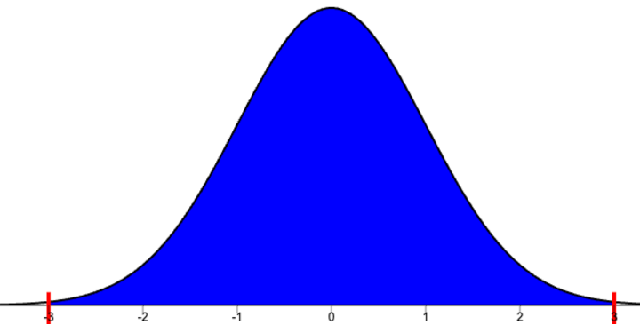

-   Use the 68-95-99.7 rule to calculate the approximate area from $z = -3$ to $z=0$.

    

    
Possible Solution

    The area within 3 standard deviation of the mean is approximately 0.997.

    

    The distribution is symmetric so the area from $z=0$ to $z=3$ will be half of 0.997.

    0.997/2 = 0.4985

    The area from $z = -3$ to $z=0$ will be approximately 0.4985 (or 49.85% of the total area).

    -   *What does that tell you about the area from* $z = 0$ *to* $z=3$*?*

        

        
Possible Solution

        Because the distribution is symmetric, it will be the same as the area from $z = -3$ to $z = 0$ (or 49.85% of the total area).

        

    

-   Use the 68-95-99.7 rule to calculate the approximate below $z=-3$.

    

    
Possible Solution

    The area within 3 standard deviation of the mean is approximately 0.997.

    

    The total area is 1, so the area in both tails combine will be 1-0.997 = 0.003.

    Since the distribution is symmetric, the area in the left tail will be half of that, 0.003/2 = 0.0015.

    The area below $z = -3$ will be approximately 0.0015 (or 0.15% of the total area).

    -   *What does that tell you about the area above* $z = 3$*?*

        

        
Possible Solution

        Because the distribution is symmetric, it will be the same as the area below $z = -3$ (or 0.15% of the total area).

        

    

