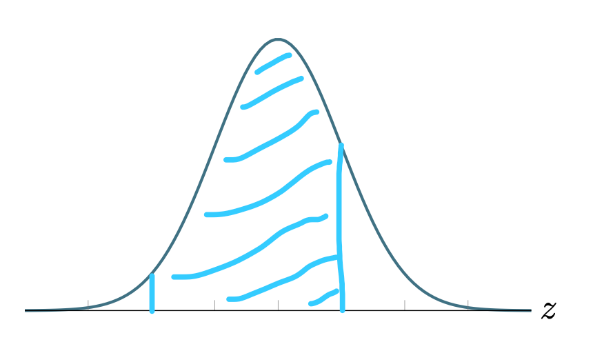
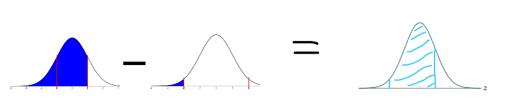

-   Use the 68-95-99.7 rule to calculate the approximate area less than $z = -2$. Remember to draw pictures as part of your solution.

    

    
Possible Solution

    The area within 2 standard deviation of the mean is approximately 0.95.

    

    The remaining area is approximately 1-0.95 = 0.05.

    Since the normal distribution is symmetric the area in the left tail (the area less than $z = -2$) is half that, 0.05/2 = 0.025.

    The area less than $z = -2$ is approximately 0.025 (or 2.5% of the total area).

    

-   Use the 68-95-99.7 rule to calculate the approximate area less than $z = 1$. Remember to draw pictures as part of your solution.

    

    
Possible Solution

    The area within 1 standard deviation of the mean is approximately 0.68.

    

    The remaining area is approximately 1-0.68 = 0.32.

    Since the distribution is symmetric the area in the left tail (the area less than $z = -1$) is half that, 0.32/2 = 0.16.

    The area less than $z = 1$ is the sum of the area to the left of $z = -1$ and the area between -1 and 1. We compute 0.16 + 0.68 = 0.84.

    The area less than $z = 1$ is approximately 0.84 (or 84% of the total area).

    

-   Use the 68-95-99.7 rule to calculate the approximate area between $z = -2$ and $z = 1$. Remember to draw pictures as part of your solution.

    

    
Possible Solution

    The area we want to find is shown below.

    

    If you subtract the area to the left of $z = -2$ from the area to the left of $z = 1$ you will be left with the area between $z = -2$ and $z = 1$.

    

    The area to the left of $z = -2$ is 0.025 (Recall the calculation $\frac{1 - 0.9 5}{2} = 0.025$ from "part a" above).

    The area to the left of $z = 1$ is 0.84 (Recall the calculation $\frac{1-0.68}{2} + 0.68 = 0.84$ from "part b" above).

    Taking away the area to the left of $z = -2$ from the area to the left of $z = 1$ we have $0.84 - 0.025 = 0.815$.

    The area between $z = -2$ and $z = 1$ is 0.815 (or 81.5% of the total area).

    

    *Can you find a group that calculated these areas different from you? What can you learn from that group?*

<!--- Winter 2023 Computation Practice #6--->
